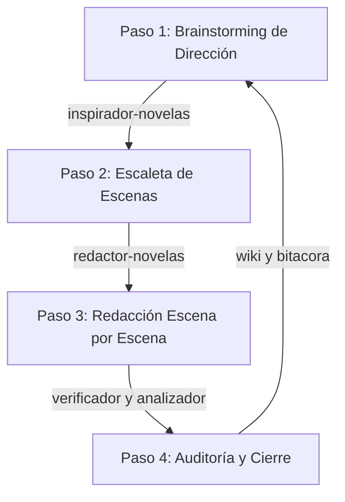

# Guía de Uso del Asistente Creativo - Proyecto Novelistico

¡Bienvenido a tu entorno de escritura interactiva asistida por IA! Este proyecto está equipado con un ecosistema de **9 Skills (habilidades) personalizadas** y un motor de reglas globales que te permiten co-escribir tu novela de forma orgánica, consistente y estructurada.

---

## 1. Estructura del Workspace y Convención de Nombres

Para mantener el orden y asegurar que la automatización de la IA funcione de manera óptima, el proyecto sigue un estándar de nombres de archivo y carpetas:

```text
novelistico/
├── .agents/                <-- Configuración e instrucciones de los Skills (No borrar)
│   ├── AGENTS.md           <-- Reglas de activación por palabras clave
│   └── skills/             <-- Carpetas individuales de cada Skill y sus ejemplos
├── wiki/                   <-- Registro modular de lore
│   ├── README.md           <-- Índice central que enlaza todos los assets
│   ├── personajes/         <-- Fichas individuales en minúsculas (ej. robert_langdon.md)
│   ├── lugares/            <-- Escenarios individuales (ej. ensenada.md)
│   ├── organizaciones/     <-- Facciones individuales (ej. illuminati.md)
│   └── objetos/            <-- Props individuales (ej. cruz_de_oro.md)
├── capitulos/              <-- Tus capítulos organizados
│   ├── capitulo_1/         <-- Carpeta contenedora por capítulo
│   │   ├── escaleta.md     <-- Plan de escenas del capítulo (Outline)
│   │   ├── escena_1_borrador.txt   <-- Notas crudas o borrador inicial del autor
│   │   ├── escena_1_final.md       <-- Prosa final redactada con formato de diálogos
│   │   ├── escena_2_final.md       <-- Prosa final de la escena 2
│   │   └── bitacora_capitulo.md    <-- Hechos locales extraídos de este capítulo
│   └── capitulo_2/         <-- Carpeta para el siguiente capítulo
│       ├── escaleta.md
│       └── ...
├── premisa_novela.md       <-- La Biblia del Universo (Sinopsis, escala de poderes) (Raíz)
├── bitacora_historia.md    <-- Registro acumulativo de toda la novela (Raíz)
├── manuscrito_completo.md  <-- Compilación unificada de todo el libro (Raíz)
└── README.md               <-- Esta guía de usuario
```

---

## 2. Cómo Iniciar una Obra Desde Cero (La Biblia del Universo)

Si estás comenzando un proyecto nuevo sin ningún texto redactado, sigue este procedimiento de inicialización:

1.  **Edita `premisa_novela.md`:** Abre este archivo en la raíz y rellena la plantilla con:
    *   Tu **sinopsis inicial** y el tono de la obra.
    *   El **objetivo narrativo** y el escalamiento del conflicto.
    *   Las **reglas físicas/mágicas** de tu mundo y la **escala de poderes** (límites y niveles).
    *   Las facciones y personajes principales.
2.  **Contexto Raíz:** El asistente leerá automáticamente `premisa_novela.md` en cada fase de redacción o lluvia de ideas para garantizar que las propuestas respeten las reglas y limitaciones de tu universo de forma de manera estricta.

---

## 3. Comandos de Atajo Rápidos (Shortcuts)

Para acelerar tu interacción con el asistente y evitar escribir peticiones largas, puedes utilizar comandos cortos en el chat que comienzan con el carácter `!`. La IA los interpretará y expandirá automáticamente en las rutas de archivo correctas:

| Comando Corto | Acción que Ejecuta la IA |
| :--- | :--- |
| **`!escaleta cap=[N]`** | Genera la escaleta inicial del capítulo en `capitulos/capitulo_[N]/escaleta.md` |
| **`!redactar cap=[N] esc=[M]`** | Escribe en detalle la escena en `capitulos/capitulo_[N]/escena_[M]_final.md` |
| **`!ritmo cap=[N] esc=[M]`** | Analiza la velocidad y pacing dramático en `capitulos/capitulo_[N]/escena_[M]_final.md` |
| **`!consistencia cap=[N] esc=[M]`**| Audita la escena final contra el Lore de la Wiki en busca de plot holes |
| **`!wiki cap=[N] esc=[M]`** | Extrae hechos del capítulo para crear o actualizar fichas individuales en `/wiki/` |
| **`!bitacora cap=[N]`** | Registra el resumen en `capitulos/capitulo_[N]/bitacora_capitulo.md` e `bitacora_historia.md` |
| **`!prompt personaje=[Nombre]`** | Genera un prompt en inglés de Hoja de Modelo (Model Sheet) del personaje |
| **`!prompt lugar=[Nombre]`** | Genera prompts en inglés para tomas en múltiples ángulos del lugar |
| **`!compilar`** | Une y depura todas las escenas finales en `manuscrito_completo.md` |

*Ejemplo de uso en el chat:* `!ritmo cap=2 esc=1`

---

## 4. Tabla Rápida de Skills y Palabras Clave

Si prefieres interactuar usando lenguaje natural libre, el asistente detectará la intención por palabras clave en tu petición:

| Skill | Propósito Principal | Palabras Clave de Activación |
| :--- | :--- | :--- |
| **`inspirador-novelas`** | Generación de ideas (Paths) y borradores cortos (Drafts). | `inspiración`, `ideas de continuación`, `opciones de trama`, `sugerir ideas`, `continuar historia` |
| **`redactor-novelas`** | Creación de escaletas y redacción detallada de prosa escena por escena. | `redactar escena`, `escaleta`, `outline de escenas`, `expandir idea`, `escribir capítulo` |
| **`verificador-consistencia`**| Auditoría de continuidad física, lógica y temporal contra la Wiki. | `consistencia`, `incoherencias`, `plot holes`, `auditoría de lore`, `verificar texto` |
| **`analizador-ritmo`** | Análisis de la curva de tensión dramática y pacing de la prosa. | `ritmo`, `pacing`, `tensión dramática`, `curva de tensión`, `analizar ritmo` |
| **`analizador-novelas`** | Reescritura de diálogos al estilo estructurado `Personaje: <Diálogo>`. | `diálogos`, `formato de diálogo`, `quitar guiones`, `estilo narrativo`, `conversaciones` |
| **`bitacora-novelas`** | Extracción cronológica de sucesos del capítulo a una bitácora. | `bitácora`, `resumen del capítulo`, `hechos clave`, `puntos de control`, `pistas` |
| **`wiki-novelas`** | Creación y actualización de fichas de lore en la carpeta `/wiki/`. | `wiki`, `biblioteca`, `actualizar wiki`, `ficha de personaje`, `ficha de lugar` |
| **`creador-prompts-visuales`**| Generación de prompts en inglés para Midjourney (Model Sheets, vistas). | `prompt de imagen`, `prompt visual`, `model sheet`, `character sheet`, `ángulo de cámara` |
| **`compilador-manuscrito`** | Fusión limpia de escenas sueltas en un borrador unificado. | `compilar`, `exportar manuscrito`, `unir capítulos`, `manuscrito completo`, `borrador final` |

---

## 5. Flujo de Trabajo Recomendado por Capítulo (Paso a Paso)

Para cada capítulo nuevo, sigue este ciclo iterativo:



1.  **Paso 1 (Dirección):** Pide ideas de continuación basadas en `premisa_novela.md` e hitos anteriores.
2.  **Paso 2 (Escaleta):** Genera la escaleta de escenas en `capitulos/capitulo_[N]/escaleta.md` y valídala. **Este es el paso más crucial de la generación del capítulo** (ver instrucciones de modificación abajo).
3.  **Paso 3 (Redacción):** Escribe las escenas de una en una en `capitulos/capitulo_[N]/escena_[M]_final.md`.
4.  **Paso 4 (Auditoría):** Verifica la continuidad con `verificador-consistencia` y actualiza `/wiki/` y `bitacora_historia.md` al terminar.

---

## 6. Cómo Modificar y Controlar la Escaleta (El Paso Crítico)

La escaleta es el mapa de ruta del capítulo. Si las escenas propuestas por el asistente no te convencen, tienes dos métodos para cambiarlas y refinar la estructura antes de que la IA empiece a redactar prosa:

### Método A: Iteración Directa en el Chat (Retroalimentación)
Puedes pedirle a la IA que modifique la escaleta dándole instrucciones precisas en lenguaje natural. 
*   *Para eliminar:* `"No me gusta la escena 3, elimínala y ajusta la lógica de las escenas siguientes."`
*   *Para agregar:* `"Agrega una nueva escena entre la 1 y la 2 donde Langdon encuentre una nota en su coche antes de salir a la autopista."`
*   *Para modificar:* `"Modifica la escena 2 para que en lugar de un diálogo amistoso, tengan una discusión tensa sobre simbología."`

### Método B: Edición Manual del Archivo Markdown
Dado que la escaleta se guarda físicamente en `capitulos/capitulo_[N]/escaleta.md`, puedes abrir el archivo directamente en tu editor y modificarlo:
1.  Edita, añade o reescribe las descripciones de las escenas a tu gusto en formato Markdown.
2.  Guarda el archivo.
3.  Indica a la IA en el chat: *"Lee la escaleta modificada en capitulos/capitulo_[N]/escaleta.md y procede a redactar la Escena 1 en base a ella."*
