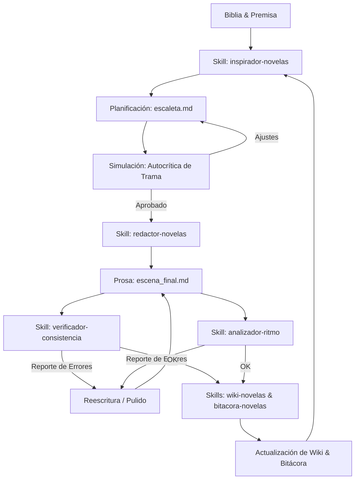

# Bitácora de Prompts e Iteración Autónoma (Prompt-Flow)

Este documento detalla el flujo de prompts, la arquitectura de agentes/skills y el bucle de autocrítica y revisión de continuidad simulado para la generación autónoma de la novela *Sangre y Hierro*.

---

## 1. Arquitectura del Flujo de Trabajo (El Bucle de Escritura)

Para escribir de forma autónoma y con consistencia editorial y de lore, implementamos un flujo secuencial e iterativo que emula la relación entre un Escritor, un Editor y un Auditor de Continuidad:

---

## 2. Definición Detallada del Flujo de Prompts por Skill

### Paso 1: Ideación e Inspiración (`inspirador-novelas`)
*   **Propósito:** Proponer caminos narrativos (Path) y borradores cortos (Draft) basados en el lore y el capítulo anterior.
*   **Prompt de Sistema (Template):**
    > Actúa como un Inspirador Literario especializado en fantasía oscura y biopunk. Tu objetivo es proponer tres caminos alternativos (Opción A, B y C) para la continuación de la novela, respetando las leyes físicas de `premisa_novela.md` y el estado de la `bitacora_historia.md`. Para cada opción, provee:
    > 1. **Título del Camino:** Nombre sugerido del capítulo.
    > 2. **Idea Clave (Path):** Explicación del conflicto y acontecimientos.
    > 3. **Borrador Literario Corto (Draft):** Un fragmento de 150 palabras de atmósfera para ilustrar el tono.

---

### Paso 2: Escaleta de Escenas (`redactor-novelas`)
*   **Propósito:** Desglosar el camino elegido en hitos de escena claros.
*   **Prompt de Sistema (Template):**
    > Eres el Redactor de Novelas en fase de Planificación. Toma el camino elegido y estructúralo en una Escaleta cronológica para el Capítulo [N]. El archivo de destino debe ser `capitulos/capitulo_[N]/escaleta.md`. Define con claridad el Objetivo/Hito, los personajes presentes, y las atmósferas visuales para evitar divagaciones en la redacción posterior.

---

### Paso 3: Revisión de la Escaleta (Autocrítica)
*   **Propósito:** Simular una revisión crítica de la escaleta antes de escribir prosa extensa.
*   **Prompt de Autocrítica (Interno):**
    > Revisa la escaleta del Capítulo [N]. ¿Es la tensión adecuada? ¿El ritmo escala progresivamente hacia el clímax del libro? ¿Las limitaciones físicas de los hematoclastos (drenaje de sangre, fatiga) juegan un rol en los hitos? Si es necesario, reescribe la escaleta antes de proseguir.

---

### Paso 4: Redacción de Prosa (`redactor-novelas`)
*   **Propósito:** Expandir la escaleta en prosa literaria inmersiva con formato de diálogo estructurado.
*   **Prompt de Sistema (Template):**
    > Eres el Redactor de Novelas en fase de Prosa. Redacta la escena [M] del Capítulo [N] siguiendo la escaleta correspondiente.
    > **Restricciones Críticas:**
    > 1. No uses guiones (`—`) para los diálogos. Emplea estrictamente el formato `Personaje: <Diálogo>`.
    > 2. Detalla con precisión las sensaciones físicas de los personajes al usar hematoclastos (hipovolemia, sudoración fría, palidez).
    > 3. Mantén la inmersión: usa vocabulario industrial y vaporoso coherente con Oakhaven.

---

### Paso 5: Auditoría de Continuidad (`verificador-consistencia`)
*   **Propósito:** Comprobar que no haya "plot holes" o inconsistencias físicas respecto a la Wiki de lore.
*   **Prompt de Sistema (Template):**
    > Eres el Auditor de Continuidad. Lee la escena redactada y compárala con las fichas individuales en `wiki/` y la `bitacora_historia.md`. Genera un reporte detallando elementos correctos `[OK]` y alertas detectadas `[ALERTA DETECTADA]`.
    > *Ejemplo de regla a buscar:* Si Alistair usa su hematoclasto de hielo en la escena, ¿se muestra débil o pálido según las cicatrices de su ficha? ¿Tiene el hematoclasto en su posesión o lo tiene otro personaje?

---

### Paso 6: Análisis de Ritmo y Pacing (`analizador-ritmo`)
*   **Propósito:** Ajustar la velocidad narrativa y eliminar info-dumping.
*   **Prompt de Sistema (Template):**
    > Eres el Analizador de Ritmo Dramático. Evalúa la tensión de la escena y detecta si hay "cabezas flotantes" (diálogo sin descripción espacial) o "valles de lentitud" (demasiada exposición técnica). Propón una reescritura directa para acelerar el ritmo si es necesario.

---

### Paso 7: Documentación de Hechos y Actualización de Wiki (`wiki-novelas` & `bitacora-novelas`)
*   **Propósito:** Registrar de forma limpia los sucesos para servir de contexto al siguiente capítulo.
*   **Prompt de Sistema (Template):**
    > Lee la escena finalizada y aprobada. 
    > 1. Crea la bitácora local en `capitulos/capitulo_[N]/bitacora_capitulo.md` y añádela a `bitacora_historia.md`.
    > 2. Actualiza la sección de "Evolución y Estado Cronológico" de las fichas en `wiki/personajes/`, `wiki/lugares/` y `wiki/objetos/` según corresponda. No sobreescribas los atributos base iniciales.

---

## 3. Ejemplo Real de Bucle de Autocrítica en la Novela (Capítulo 4)

A continuación se muestra una reconstrucción de cómo operó el bucle de autocrítica autónoma durante la generación del **Capítulo 4: El Precio del Milagro**:

1.  **Primera Versión de la Escaleta (Rechazada por Pacing):**
    *   *Detalle original:* Alistair y Katherine entraban a la fundición, peleaban con Kohler, Alistair se desmayaba de la nada y Katherine corría con él a cuestas.
    *   *Autocrítica de Pacing:* El clímax del libro está planificado para el Capítulo 5. Enfrentar a Kohler en el Capítulo 4 arruina la curva de tensión y hace redundante el sabotaje final. El síncope de Alistair debe estar justificado físicamente por el uso de su hematoclasto de hielo al límite.
    *   *Ajuste realizado:* Se retrasó el enfrentamiento con Kohler al Capítulo 5. En el Capítulo 4, se introdujo una emboscada de guardias en una pasarela estrecha donde Alistair sobrecarga voluntariamente su arma para salvar a Katherine, justificando su shock anémico.
2.  **Verificación de Continuidad Física (Revisión de Lore):**
    *   *Alerta Detectada:* El borrador inicial mencionaba que Katherine inyectaba a Alistair con una "poción médica".
    *   *Contradicción de Lore:* La premisa de la novela especifica que **no existe la magia**. Las pociones médicas violan la coherencia biopunk/steampunk del universo.
    *   *Corrección:* Se modificó la acción para que Katherine utilice un kit de transfusión de campo militar y le realice una transfusión directa brazo a brazo en una sala de control oculta. Esto los deja a ambos débiles para el capítulo final, lo cual incrementa el suspenso dramático de forma orgánica.
